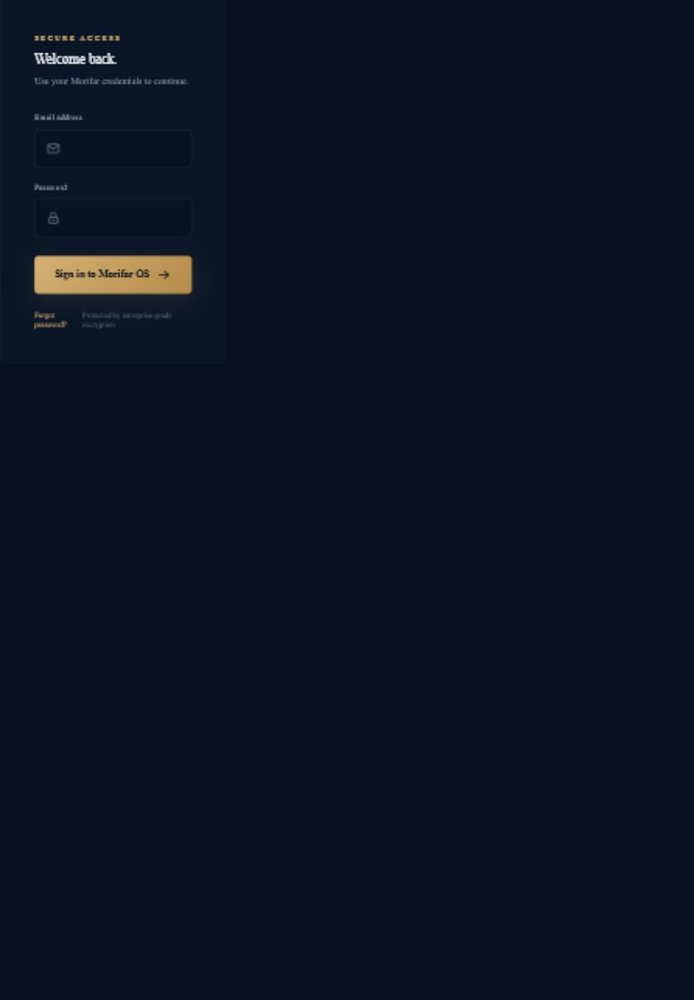
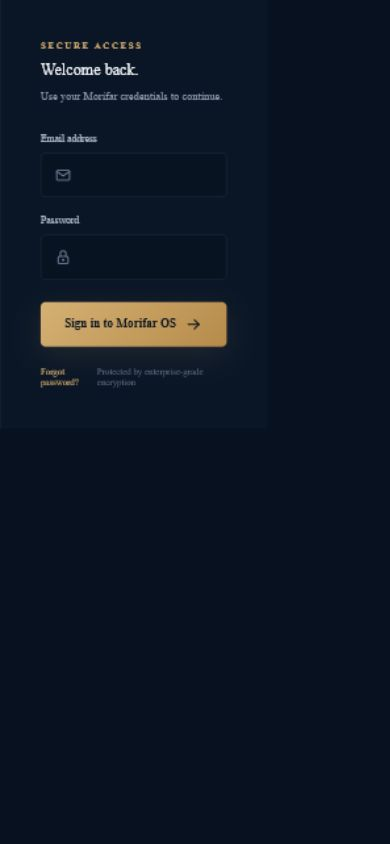

# Morifar OS QA Audit

Date: 2026-06-28  
Target: https://morifar-os.vercel.app with Vercel share access supplied for the audit  
Reviewer account tested: reviewer@morifar.local

## 1. Pages Tested

### Public / unauthenticated

| Page | Result |
| --- | --- |
| `/login` | Loads successfully with email and password fields. |
| `/forgot-password` | Loads successfully. |
| `/` | Redirects to `/login?next=%2F` when unauthenticated. |
| `/dashboard` | Redirects to `/login?next=%2Fdashboard` when unauthenticated. |
| `/crm` | Redirects to `/login?next=%2Fcrm` when unauthenticated. |
| `/leads` | Redirects to `/login?next=%2Fleads` when unauthenticated. |
| `/leads/new` | Redirects to `/login?next=%2Fleads%2Fnew` when unauthenticated. |
| `/tasks` | Redirects to `/login?next=%2Ftasks` when unauthenticated. |
| `/tasks/new` | Redirects to `/login?next=%2Ftasks%2Fnew` when unauthenticated. |
| `/ai-professionals` | Redirects to `/login?next=%2Fai-professionals` when unauthenticated. |
| `/ai-command-center` | Redirects to `/login?next=%2Fai-command-center` when unauthenticated. |
| `/workflow-engine` | Redirects to `/login?next=%2Fworkflow-engine` when unauthenticated. |
| `/notifications` | Redirects to `/login?next=%2Fnotifications` when unauthenticated. |
| `/settings` | Redirects to `/login?next=%2Fsettings` when unauthenticated. |
| `/search` | Redirects to `/login?next=%2Fsearch` when unauthenticated. |

### Authenticated pages

Authenticated QA was blocked on the deployed app because the supplied reviewer credentials returned:

> Email or password is incorrect.

The protected route guard itself worked correctly, but dashboard loading, authenticated navigation, workflow pages, CRUD forms, and logout execution could not be fully verified on Vercel until the bootstrap credentials are refreshed by redeployment.

## 2. Bugs Found

### Critical

1. **Reviewer login fails on deployed Vercel app**
   - Expected: supplied reviewer credentials sign in and land on `/dashboard`.
   - Actual: Login form returns `Email or password is incorrect.`
   - Impact: ChatGPT or any external reviewer cannot inspect the running app beyond the login gate.
   - Root cause found in code: bootstrap user seeding used `INSERT OR IGNORE`, so an existing `usr_admin` row did not update when Vercel environment credentials changed.
   - Fix applied: bootstrap user now upserts the configured email/password/name and reactivates the account.

### Non-critical

1. **Login page visual density on smaller breakpoints**
   - Mobile and tablet login layouts have no horizontal overflow and remain usable.
   - The layout is visually sparse on narrow screens because the brand panel collapses and the form remains compact.
   - Recommendation: polish in a later UI pass; no functional redesign applied in this audit.

2. **Experimental SQLite warnings during production build**
   - Build completes successfully, but Node reports `SQLite is an experimental feature`.
   - Recommendation: move production persistence to a supported external database before relying on Vercel for real customer data.

## 3. Console Errors

No browser console errors or warnings were captured during:

- `/login`
- Failed login attempt
- Unauthenticated protected-route redirects
- `/forgot-password`
- Desktop/tablet/mobile login rendering

## 4. Broken Routes

No broken deployed routes were confirmed in the unauthenticated route matrix.

Important limitation: authenticated route contents could not be inspected because login failed with the supplied reviewer account.

## 5. UX Issues

1. Failed login messaging is clear and visible.
2. Login button enters a pending state while the server action runs, then recovers correctly after failure.
3. Forgot password page is accessible and provides an administrator-support path.
4. Protected routes preserve the requested destination via `next`, which is good for post-login routing.
5. The deployed Vercel share link is usable for public/login pages, but reviewers still need working app credentials.

## 6. Mobile Issues

Breakpoints tested:

- Desktop: 1440 x 1000
- Tablet: 820 x 1180
- Mobile: 390 x 844

Findings:

- No horizontal overflow detected on login at tested breakpoints.
- Email/password inputs remain visible and usable.
- The login panel remains compact on mobile/tablet and can feel under-composed, but this is not a release blocker.

Screenshots:

- `qa-screenshots/desktop-login.png`
- `qa-screenshots/tablet-login.png`
- `qa-screenshots/mobile-login.png`

## 7. Priority Fixes

### P0

1. Redeploy Vercel after the bootstrap-user upsert fix.
2. Confirm these Vercel environment variables are set:
   - `AUTH_SECRET`
   - `MORIFAR_BOOTSTRAP_EMAIL=reviewer@morifar.local`
   - `MORIFAR_BOOTSTRAP_PASSWORD=<temporary reviewer password>`
3. Retest login and authenticated dashboard access.

### P1

1. Re-run authenticated QA after login succeeds:
   - Dashboard loading
   - Sidebar navigation
   - Workflow Engine
   - AI Command Center
   - CRM
   - Leads
   - Tasks
   - Settings
   - Notifications
   - Search
   - Logout
2. Replace Vercel `/tmp` SQLite persistence with a production database for stable review and production data.

### P2

1. Refine mobile/tablet login composition without changing product direction.
2. Add automated smoke tests for login, route protection, and core navigation.

## 8. Screenshots

Desktop login:

Tablet login:

Mobile login:

## Verification

Local verification after the critical auth seed fix:

- `tsc --noEmit --pretty false`: passed
- `next build`: passed

Build note: Next.js production build succeeded. Node emitted experimental SQLite warnings, which are expected from the current local SQLite implementation.
